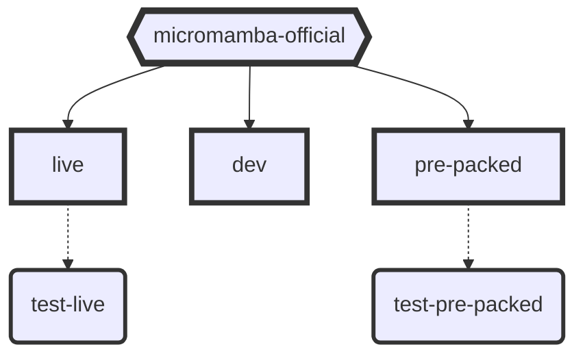

# DevOps Workshop

## Build stage command

`docker build --target live -t git.example.com/micromamba-0.24.0-live:latest .`

&nbsp;

## Export micromamba lock

`micromamba env export --name base --explicit > env.lock`

&nbsp;

## Run Test suite

- `python -m unittest main`
- `python -m unittest main.TestMicromambaEnvironmentLock`

&nbsp;

## Create micromamba test environment

`micromamba create -n test python numba numpy -c conda-forge`

&nbsp;

## Run JupyerLab Notebook

`docker run --rm -p 8888:8888 <hash>`

secure access with pre-hashed password mounted to container under windows

`docker run --rm -p 8888:8888 -e JUPYTER_TOKEN="testme" -v //conf//:/home/mambauser/.jupyter <hash>`

&nbsp;

## Image Dependency

&nbsp;

&nbsp;

## Conda Channel

There are several channels availible for package installation:

- **`default`**: May require a paid license
- **`conda-forge`**: Free to use for all
- **`bioconda`**: Special channel for biomedical research packages

&nbsp;

## Prometheus Metrics Endpoint

The endpoint is enabled by default. You can toggle off authentication if you like.

`https://jupyterlab:8888/metrics`

&nbsp;

## Docker Compose

- `docker-compose --profile dev up --build --force-recreate`
- `docker-compose --profile dev up`
- `docker-compose --profile test up --build --force-recreate`
- `docker-compose --profile test`
